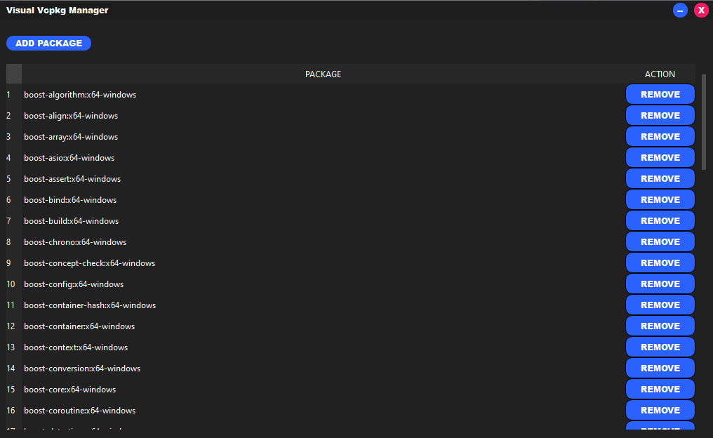
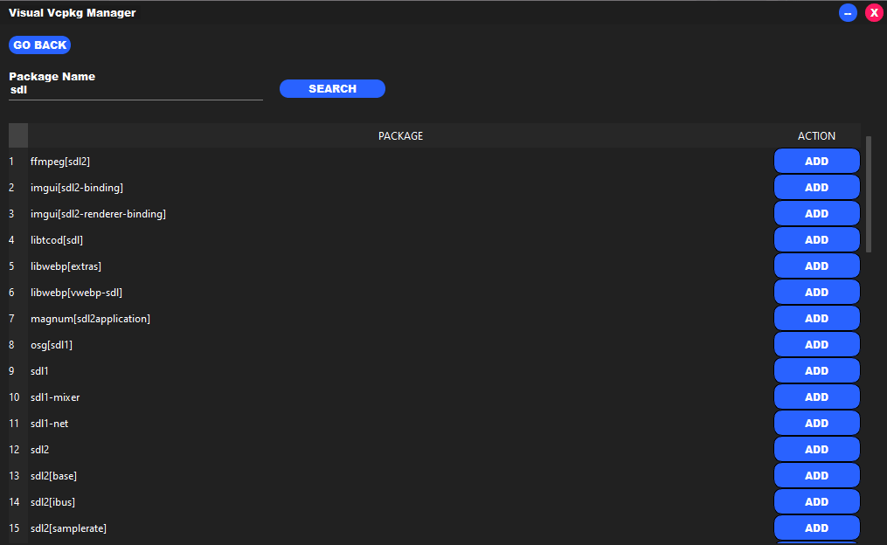

# Visual Vcpkg manager

Visual Vcpkg manager is a app built with  [QT C++](https://www.qt.io) that allows you to manage vcpkg visually.





## Build
windeployqt.exe --no-translations "C:\release-path\release\visual-vcpkg-manager.exe"